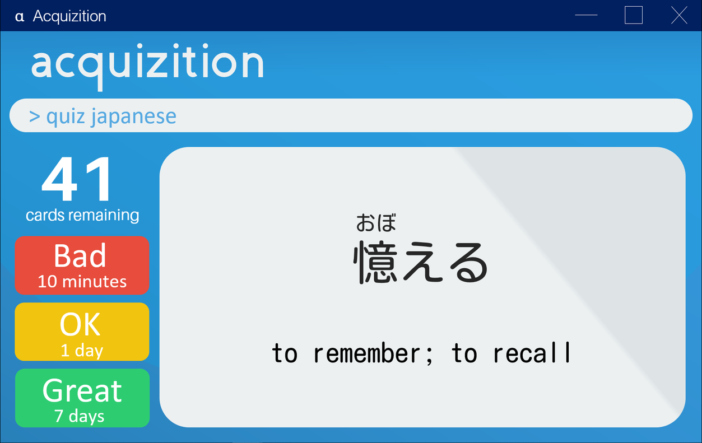

= Acquizition
ifdef::env-github,env-browser[:relfileprefix: docs/]

https://travis-ci.org/cs2103-ay1819s2-t12-2/main[image:https://travis-ci.org/cs2103-ay1819s2-t12-2/main.svg?branch=master[Build Status]]
https://ci.appveyor.com/project/sergiovieri/main[image:https://ci.appveyor.com/api/projects/status/ukgcotxvrf021ksr/branch/master?svg=true[Build Status]]
https://coveralls.io/github/cs2103-ay1819s2-t12-2/main?branch=master[image:https://coveralls.io/repos/github/cs2103-ay1819s2-t12-2/main/badge.svg?branch=master[Coverage Status]]
https://www.codacy.com/app/sergiovieri/main?utm_source=github.com&utm_medium=referral&utm_content=cs2103-ay1819s2-t12-2/main&utm_campaign=Badge_Grade[image:https://api.codacy.com/project/badge/Grade/caf9760ff67c48b498d39589c74ac45a[Codacy Badge]]

ifdef::env-github[]

endif::[]

ifndef::env-github[]
image::images/Ui.png[width="600"]
endif::[]

* _Acquizition_ is a desktop flashcard application for subject revision and language acquisition.
* Using a scientifically-grounded SRS (Spaced Repetition System), _Acquizition_ maximizes
memory retention by testing the terms most likely to be forgotten soon.
* _Acquizition_ has a sleek and intuitive GUI (Graphical User Interface) to streamline the experience
for new users, but also sports a CLI (Command Line Interface) to maximize the efficiency of
power users. It's the best of both worlds!

== Interested?

* Get started with _Acquizition_ by immediately heading over to our <<UserGuide#, User Guide>>!
* _Acquizition_ is an open-source project. If you want to help contribute, please check out our <<DeveloperGuide#, Developer Guide>>!

== Site Map

* <<UserGuide#, User Guide>>
* <<DeveloperGuide#, Developer Guide>>
* <<AboutUs#, About Us>>
* <<ContactUs#, Contact Us>>

== Acknowledgements

* _Acquizition_ is adapted from the https://github.com/se-edu/addressbook-level4[addressbook-level4] project created by the https://github.com/se-edu[se-edu initiative].
* Libraries used: https://github.com/TestFX/TestFX[TestFX], https://github.com/FasterXML/jackson[Jackson], https://github.com/google/guava[Guava], https://github.com/junit-team/junit5[JUnit5]

== Licence : link:LICENSE[MIT]
